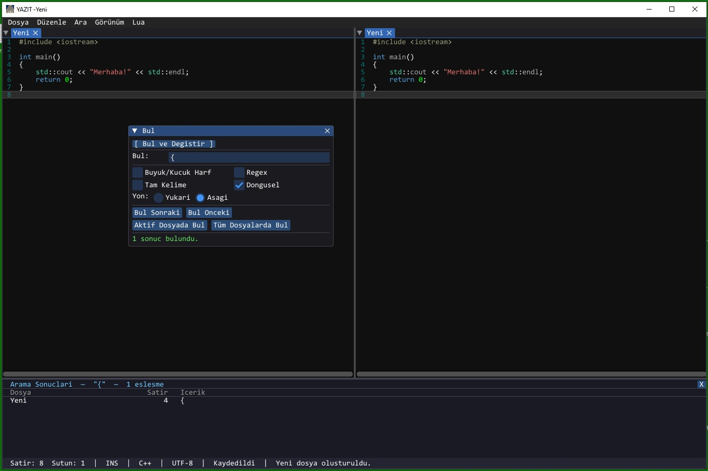
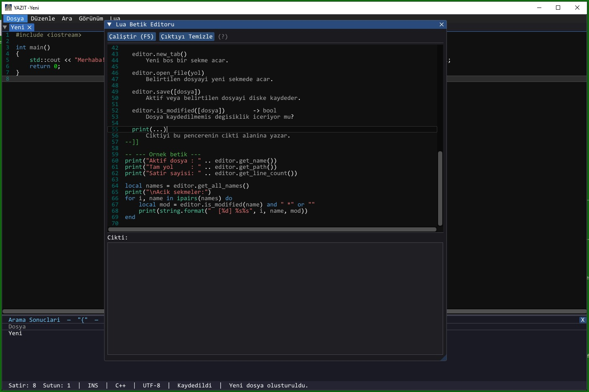

# Yazıt

Notepad++ benzeri, SDL2 + Dear ImGui tabanlı bir kod/metin editörü.

---

## Ekran Görüntüleri

<p align="center">
  
</p>
<p align="center">
  
</p>

---

## Kullanılan Kütüphaneler

| Kütüphane | Sürüm / Kaynak | Açıklama |
|-----------|---------------|----------|
| [SDL2](https://github.com/libsdl-org/SDL) | vcpkg | Pencere yönetimi ve olay döngüsü |
| [SDL2_image](https://github.com/libsdl-org/SDL_image) | vcpkg | Görüntü yükleme (simge vb.) |
| [SDL2_mixer](https://github.com/libsdl-org/SDL_mixer) | vcpkg | Ses desteği |
| [SDL2_ttf](https://github.com/libsdl-org/SDL_ttf) | vcpkg | TrueType yazı tipi desteği |
| [SDL2_net](https://github.com/libsdl-org/SDL_net) | vcpkg | Ağ desteği |
| [GLEW](https://github.com/nigels-com/glew) | vcpkg | OpenGL uzantı yükleyici |
| [Dear ImGui](https://github.com/ocornut/imgui) | vcpkg | Anlık mod GUI çerçevesi |
| [ImGuiColorTextEdit](https://github.com/BalazsJako/ImGuiColorTextEdit) | vendored (`src/ImGuiColorTextEdit/`) | Sözdizimi renkli metin editörü widget'ı |
| [Lua](https://www.lua.org/) | vcpkg | Betik dili motoru |
| OpenGL 3.x | sistem | GPU render arka ucu |

---

## Derleme

### Gereksinimler

- CMake ≥ 3.20
- MSVC (Visual Studio 2019/2022, x64)
- [vcpkg](https://github.com/microsoft/vcpkg)

### Adımlar

```bash
# 1. vcpkg bağımlılıklarını yükle
vcpkg install sdl2 sdl2-image sdl2-mixer sdl2-ttf sdl2-net glew imgui lua

# 2. Projeyi yapılandır
cmake -B build -S . -DCMAKE_TOOLCHAIN_FILE="<vcpkg-kök>/scripts/buildsystems/vcpkg.cmake" -A x64

# 3. Derle
cmake --build build --config Release
```

Çıktı: `build/Release/YAZIT.exe`

---
## Yapılacaklar
1- Kayıt edilmemiş dökümanların çıkış esnasında "Kayıt edilsin mi?" sorgusu eklenecek.

2- Görünüm-> Dil seçnekleri kullanıcı tarafından çoğaltılması sağlanacak. Özellikle GCode görünümü eklenecek.

## Lisans

Bu proje **MIT Lisansı** ile lisanslanmıştır. Ayrıntılar için [`LICENSE`](LICENSE) dosyasına bakın.

> **Yasal Uyarı:** Bu yazılım "olduğu gibi" sağlanmaktadır; açık veya zımni hiçbir garanti verilmemektedir.
> Yazılımın kullanımından doğabilecek herhangi bir zarar, veri kaybı veya başka bir sorun için
> geliştiriciler sorumlu tutulamaz. Kullanım riski tamamen kullanıcıya aittir.

---

## Üçüncü Taraf Bileşenler

YAZIT çeşitli açık kaynak kütüphaneler kullanmaktadır. Bu kütüphanelerin lisans metinleri için
[`THIRD_PARTY_LICENSES.md`](THIRD_PARTY_LICENSES.md) dosyasına bakın.

| Kütüphane | Lisans |
|-----------|--------|
| SDL2 | zlib |
| Dear ImGui | MIT |
| ImGuiColorTextEdit | MIT |
| Lua | MIT |
| GLEW | Modified BSD |
